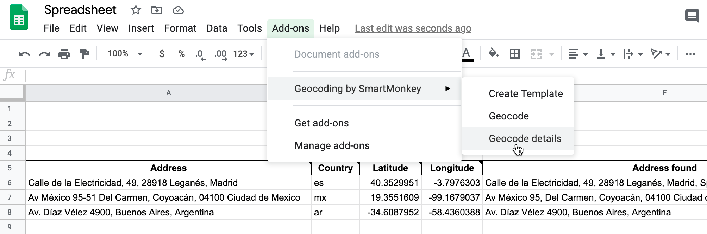

# Connecticut Office of the Arts grants map

## Live links (replace with your own)
- Leaflet Map https://jackdougherty.github.io/coa-grants-map/
- Google Sheet https://docs.google.com/spreadsheets/d/1Knh8x9U3COUSrvsZpTxdePIUDlQmgvl5jDLdTioS5HA/edit#gid=0

## Create your own
See step-by-step tutorial in *Hands-On Data Visualization* https://handsondataviz.org/leaflet-maps-with-google-sheets.html

## Customization Notes
IMPORTANT: This repo has been customized from the standard Leaflet Maps with Google Sheets template. Be careful not to overwrite these code features in any future updates:
- year.filter.js: Inserted an additional filter to display “Year” above “Grant Types," where Years appears in reverse chronological order, and ONLY the most recent year should be checked by default at startup (and prior years unchecked). Also, when author adds more data to the sheet (2021, 2022, etc.) in years to come, the code will still display ONLY the most recent year checked by default (and prior years unchecked).
- pop-up anchor point: was difficult to see at very bottom of map marker, so moved a few pixels up
- Note from @ilyankou - Making sure the arrow to minimize/mazimize the legend works correctly was much more difficult than I thought as it doesn’t combine naturally with our “ladder” system of controls stacking. If you decide to add polygons or polylines with controls, you may discover their arrows are broken — let me know, and I may be able to fix.
- Style note from @ilyankou - I added a short CSS block to get rid of the semi-transparent round boundaries around controls, and make them more rectangular with shade — I think it looks better that way, but if you disagree, you can easily reset by commenting out (or deleting) the .leaflet-control style definition at the end of the CSS file.

#### Geocode your address data with Google Sheets add-on
To geocode (find latitude and longitude coordinates), we recommend installing the free [Geocoding by SmartMonkey add-on for Google Sheets](https://gsuite.google.com/marketplace/app/geocoding_by_smartmonkey/1033231575312). Insert your addresses in place of the samples in the Geocoding Details tab, then use Add-Ons > Geocoding > Geocode Details menu. Learn more in *Hands-On Data Visualization* https://handsondataviz.org/geocode.html

